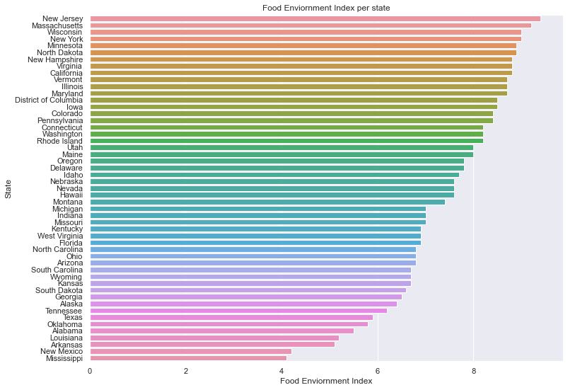
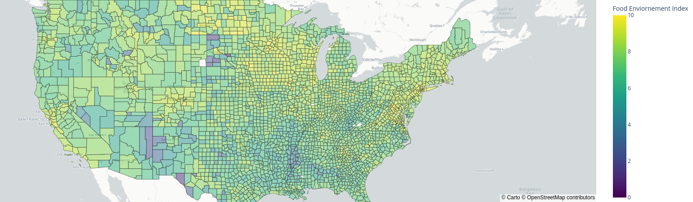

# Researching food quality
___

The food enviroment is a measure of how manu low-income has low access to a grocery stores, and a percentage that does not have a acess to a reliable source of food. This could mean that either the healthy foods are to expensive to buy, or that the distancing from households to the local supermarket or grocery store is far to great for being a viable resource[1].

Addtionally it is clear that a majority of the top food enviroment index rankings states are located on on the east side of the country, but more importantly in the north side of the country. This is quite crusial as it is far easier to grow food and keep them maintaned at cool temperatures compared to desert like conditions. This implies more fresh veggies et cetera. 
Likewise it is far eaiser to make cities if you have acess to water compared to being in the middle of the dessert. This makes for more communicipalities, and thus more grocery stores! 
The is seen on the figure below, where a majority of the yellow (index level 9 - 10) mostly are located in the top region of the country. 

:::caution

There a few *white* dots on the maps, these are counties which have no data and thus are not being able to be showed on the heatmap

::::

:::tip **Sources**
[1] https://www.njhealthmatters.org/indicators/index/view?indicatorId=2362&localeTypeId=2