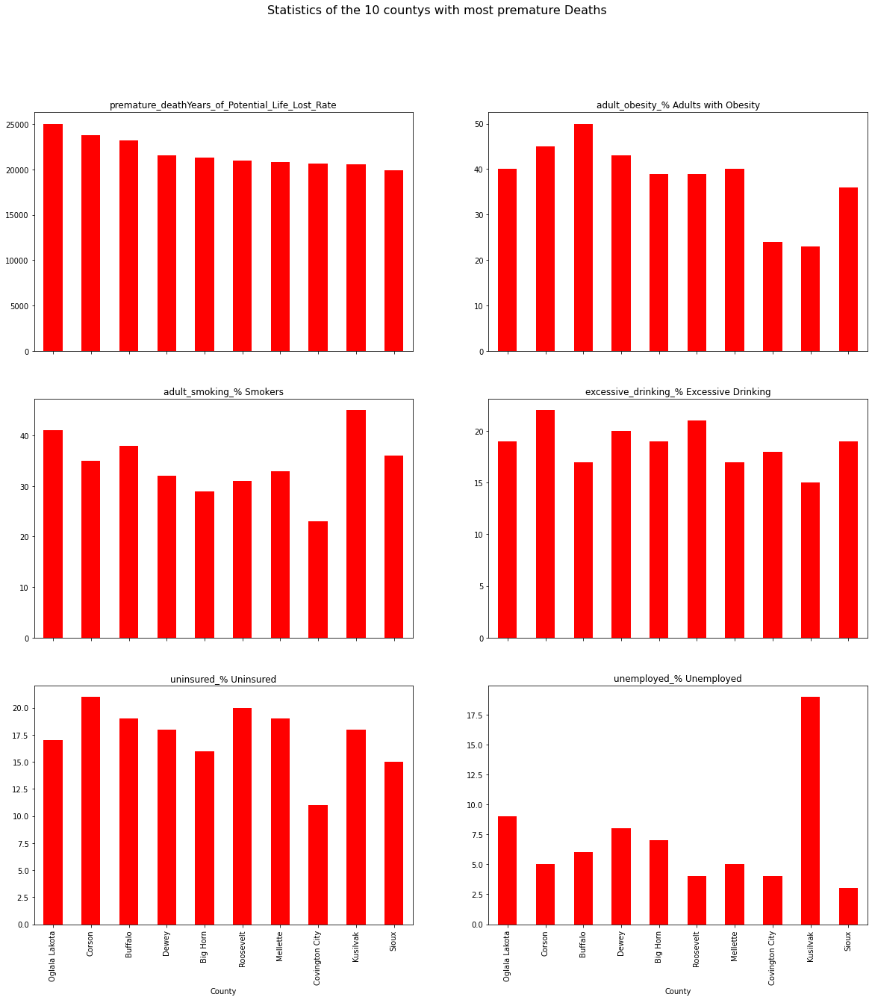

# Diving into statewise selections
___

By further categorizing and grouping values we can get the premature deaths county wise. 

| County 	| Premature deaths 	|
|---:	|---:	|
| Oglala Lakota 	| 348.0 	|
| Corson 	| 106.0 	|
| Buffalo 	| 46.0 	|
| Dewey 	| 121.0 	|
| Big Horn 	| 293.0 	|
| Roosevelt 	| 251.0 	|
| Mellette 	| 56.0 	|
| Covington City 	| 156.0 	|
| Kusilvak 	| 137.0 	|
| Sioux 	| 95.0 	|

