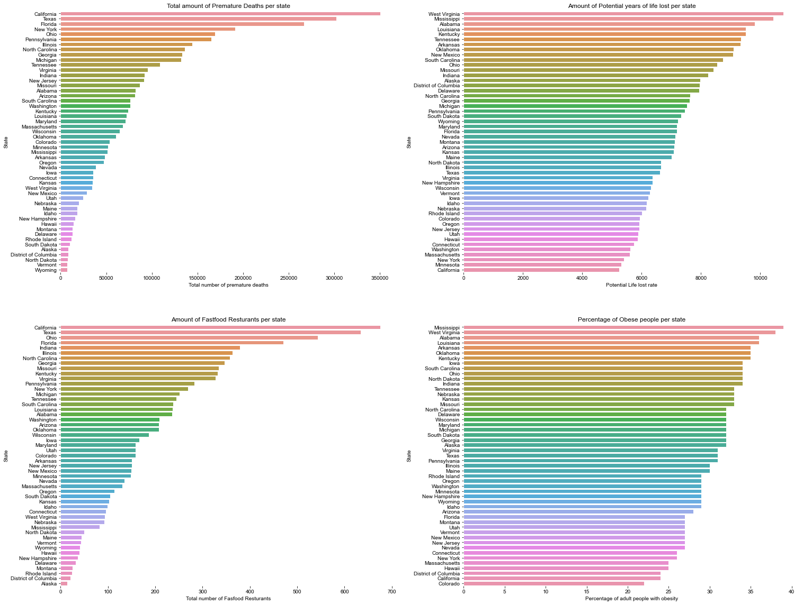
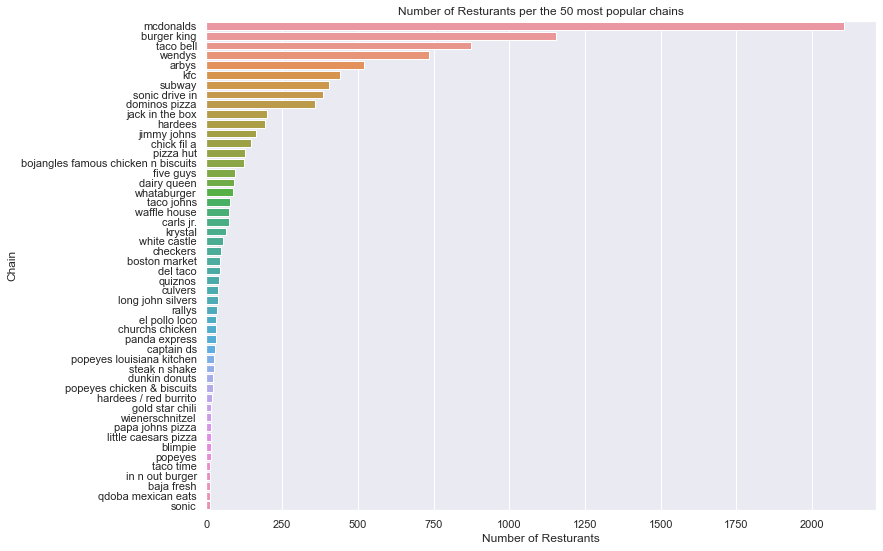

import useBaseUrl from '@docusaurus/useBaseUrl';

# Understanding the data
Let's dive deeper into fantastic world of data

### Looking at health and food correlations
____ 

Sorting the state data based on which state has the highest premature deathcounts

| State 	| County 	| Premature deaths	|
|---:	|---:	|---:	|
| 6000 	| California 	| 350612.0 	|
| 48000 	| Texas 	| 302432.0 	|
| 12000 	| Florida 	| 266657.0 	|
| 36000 	| New York 	| 191195.0 	|
| 39000 	| Ohio 	| 169097.0 	|

:::tip Want to view the picture better?
You can click on the picture to open it in a new window. Here you can zoom in on the details you like. 

:::

Looking at the figure above, *California* has the highest number of Premature deaths per state, **while having the lowest potential years of life lost per state**.
Similarly looking at the number of fastfood restaurants per state, *California*, hits the top spot. 
This could indicate some relation between the number of fastfood restaurants and the health of the population.  

One would arguably make the point that one of the reasons of this could be the affects of the poor quality of food, but looking closer we also see that the percentage of obesed persons, california is 2nd lowest. 
This could imply that eating healthy is quite modern in California. 

Backing this up is the fact that by law California has focus on health benifets and tries to aid the population into a healthier diet.
[1]
This is not however the first time that the state sets its mark as being a leader in a new world of healthy foods, as suggested by **[this article](https://www.visitcalifornia.com/experience/8-california-food-trends/)**, California started its journy towards eating better decades ago. Veggies and international cousines filled with vitamins as well as sourcing local incredients has been a main focus for some time now! 
### What are the most popular fast-food restaurant chains? 
____

McDonald's is by far the most popular fast food restaurant chain in the US. 

Eventhough McDonald's top the list above it was not the first fastfood restaurant, the first fast-food chain is not even in top 10. 
However many of the famous, restaurants opened in the perid of 1940(mcdonalds) to 1965(subway & dominos). 
The expansion of fastfood restaurants began with a culture change, where as seen with McDoalds' meals no longer require preperation time, shopping, doing the dishes, not even a table as the concept is; *You can eat it with your bare hands*. This leads to a trend of american meals, where over 20% of meals are eaten in cars.[3]

:::tip Sources

[1] https://abcnews.go.com/Health/Diet/story?id=5393222&page=1#:~:text=A%20new%20law%20makes%20California%20the%20first%20state%20to%20ban%20trans%20fats.&text=July%2025%2C%202008%20%E2%80%94%20%2D%2D%20Gov,free%20state%20in%20the%20nation.  
[2] https://www.visitcalifornia.com/experience/8-california-food-trends/  
[3] https://web.colby.edu/st297-global18/2018/10/29/americas-fast-food-obsession/#:~:text=One%20of%20the%20main%20reasons,and%20get%20a%20full%20meal.  

:::

